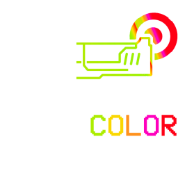

# ULTRACOLOR

A mod that enables users to recolor various ingame effects.

# Supported Weapons / Effects

- Revolver (all variations)
    - 
    - Muzzle flash sprite
    - Muzzle flash environmental light
    - Beam start/end
    - Charge beam muzzle flash sprite
    - Charge beam start/end
    - Charge beam charge effect sprite
- Coin
    -
    - Coin trail start/end 
    - Marksman reflected beam start/end
- Shotgun
    -
    - Core flash sprite
    - Muzzle flash sprite
    - Muzzle flash environmental light
    - Projectile trail start/end
- Nailgun
    -
    - Muzzle flash sprite
    - Muzzle flash environmental light
    - Nail trail start/end
    - Saw trail start/end
    - Magnet trail
    - Heated nail trail start/end
    - Heated saw trail start/end
- Railcannon
    -
    - Electric railcannon muzzle flash sprite
    - Electric railcannon muzzle flash environmental light
    - Malicious railcannon explosion
    - Screw railcannon trail start/end
- Rocket Launcher (both variations)
    - 
    - Rocket trail start/end
    - Cannonball trail 

# Requirements

- BepinEx (https://thunderstore.io/c/ultrakill/p/BepInEx/BepInExPack/)
- PluginConfigurator (https://thunderstore.io/c/ultrakill/p/EternalsTeam/PluginConfigurator/)

# Configuration

Settings must be enabled in Plugin Configurator to appear in game. Some effects require a level restart to take effect.

# Known Issues

# Planned Features

- Revolver
  - Coin flash color
- Enemy parry flash color
- Railcannon
  - Electric railcannon beam lightning colors

---

# Thank You

Hakita and team for making Ultrakill, the best game ever

originally inspired by (https://thunderstore.io/c/ultrakill/p/The0x539/RcHud/)

Thank you to Theo for testing!

